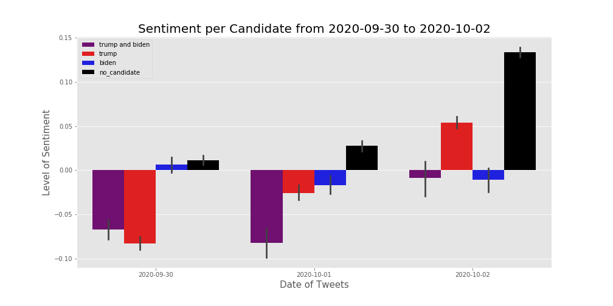
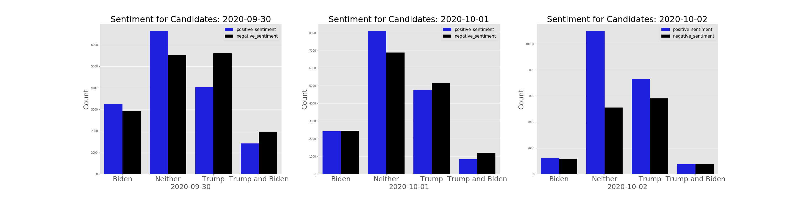
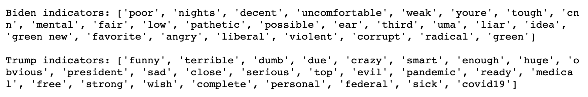
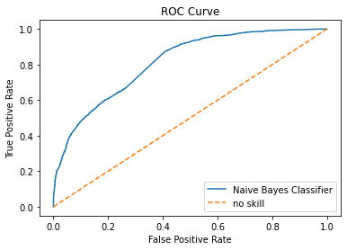

# Trick or Tweet: Sentiment Towards Presidential Candideates

## Introduction

With the 2020 Presidential Elections quickly approaching, Twitter has never been more active. Tweets surrounding the first Presidential debates were analyzed in the attempt to answer the following question: How do tweets represent the sentiment of twitter users? The stakeholders in this space are Politicians, Reporters and the media, and the American people.

## EDA: 
We have information about 140,337 tweets ranging from September 29th, 2020 to October 2nd, 2020 all with a political focus.

Among other data points, each individual tweet had information pertaining to the full text, hashtags, create date, retweet status, and user information.  We decided to focus on analysis of the text of the tweet, especially in regards to the differences between tweets that mention Donald Trump versus those that mention Joe Biden.

There were a total of 68201 tweets that mention only Donald Trump, 23389 tweets that only mention Joe Biden. Further investigation showed that there were 10210 tweets that mentioned both candidates and 67561 tweets that mentioned neither candidate.

Once the tweets were tagged by candidate, a histogram showed that a handful of tweets got a disproportionate number of retweets.  3,121 tweets had over 400,000 retweets attributed to them each.

  

It turned out that 3,120 of these tweets all contained the same text: “RT @realDonaldTrump: Tonight, @FLOTUS and I tested positive for COVID-19. We will begin our quarantine and recovery process immediately. We…,” which was Trump’s announcement that he had COVID-19.  The remaining tweet was a retweet of a Taylor Swift tweet reading, “RT @taylorswift13: After stoking the fires of white supremacy and racism your entire presidency, you have the nerve to feign moral superior…”.  This means that within our data set, if multiple users retweet the same tweet, they are entered as separate rows and the retweet count column contains the lifetime retweets of the original tweet.

To make the most retweeted tweets not outweigh the rest of the data during analysis, rows containing duplicate tweet body text were dropped from the dataframe, leaving 72,746 tweets.  Once extra retweets were dropped, the ratio of Biden to Trump focused tweets dropped slightly from .34 to .31.

## SENTIMENT ANALYSIS:

To further our EDA, we thought it would be important to look at the sentiment analysis of the tweets surrounding the presidential election. We thought that the best way to complete this task, would be to separate the tweets based on which presidential candidate was mentioned. Once this task was completed we needed to figure out how to calculate the sentiment of each individual tweet. 

For this project, we utilized a library called VADER sentiment analysis. VADER contains a lexicon that utilizes a rule-based sentiment analysis tool which looks specifically at sentiments expressed in social media. VADER will rate each sentiment on a scale ranging from -1, being the most negative, to +1, being the most positive sentiment. We then used VADER on each individual tweet and created a separate column labeled as sentiment.

Once we calculated the sentiment for each presidential candidate’s tweets, we mapped it out over the three dates that the data contained. Which is visible in the graph below: 

  

As you can see, it seems that the majority of tweets that actually mention either of the candidates, has an overall negative sentiment. While those that mentioned neither, had an overall positive sentiment. This is really interesting! Once we saw these results, we were interested in looking at the breakdown of positive to negative sentiment for each candidate. Let’s view this now.

  

Wow, interesting! Although there seems to be a difference in the counts of positive sentiment and negative sentiment tweets, there doesn’t seem to be much of a difference between the two. Meanwhile, the tweets where there is no candidate mentioned, it seems to have an overall positive sentiment.

## Model:
We can see that people are saying largely negative things about the candidates, but what vocabulary are they using?

In order to answer this question, we developed and tuned a naive Bayes classifier with a TFIDF vectorizer with 10,000 features and unigram and bigrams (one and two word phrases) as features.

Although we built a predictive model, the primary purpose isn’t to predict the subject of a tweet; it’s to look at the features to understand the conversation surrounding the two candidates. Once the model was built, we looked at the features with the highest log probabilities for each candidate to get a sense of what people were tweeting about when they mentioned the candidate.  

Initially the model was run using the full text with unigrams, bigrams and trigrams as features. The accuracy was 99%, partially because so many of the tweets specifically had to do with Trump and COVID-19 or mentioned the candidates’ first names (last names were on the stop words list, not yet first names) and the number of Trump tweets outweighed the Biden tweets, incentivize the model to sacrifice recall for Biden in order to play the odds.  The results were akin to being put back into a time capsule that landed in late September 2020 (roughly 1000 years ago, right?).  Features that predicted Biden included “jill” (as in “Biden”),  “shut” (“up man”), whereas features that predicted Trump were “positive” (“tested”) and “condemn” (“white supremacy). While these make sense and 99% accuracy feels amazing, they didn’t do much to inform us about the sentiments people feel towards those candidates.

To accomplish this, rather than using the full text to build the classifier, we used NLTK’s position tagging function, which infers a word’s part of speech, to create a string of adjectives found in each tweet.  46,577 of the 72,726 tweets had adjectives, including 23,081 mentioning only Trump and 7,241 only mentioning Biden.  Tweets that mentioned neither or both candidates were excluded from the model.  Because of the class imbalance, Biden’s data was upsampled so that each class had 23,081 tweets.

We compiled a list of stopwords, such as “speedy”, “positive”, and “negative,” because while these are adjectives and also strong class indicators (the first two for Trump because they appear in tweets about his COVID diagnosis and the latter for Biden in regards to his negative diagnosis), they don’t give insight into the sentiments of the tweets’ authors.

Running the model now with the adjective strings and only unigrams and bigrams gave 70% accuracy, with a ROC AUC score of .81.  We cross-referenced the lists of the top features by log probability for each candidate and kept only the words that were unique to each candidate.  The image shows that the words seem to be mostly neutral/negative for Biden and more polarized for Trump, not necessarily unexpected given the fact that it’s Twitter. 

  

  

While we continuously updated our stopword list with each pass, ultimately non-adjectives continued to sneak in.In further research, we would like to examine how sentiment towards these candidates evolves over time.# trick-or-tweet
